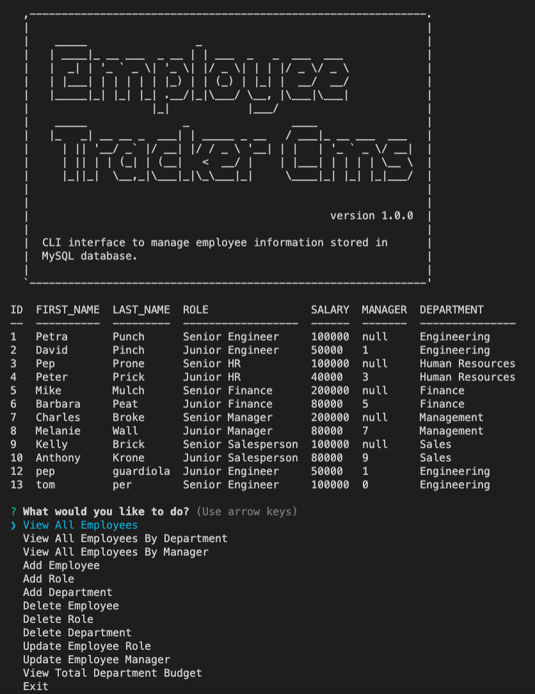
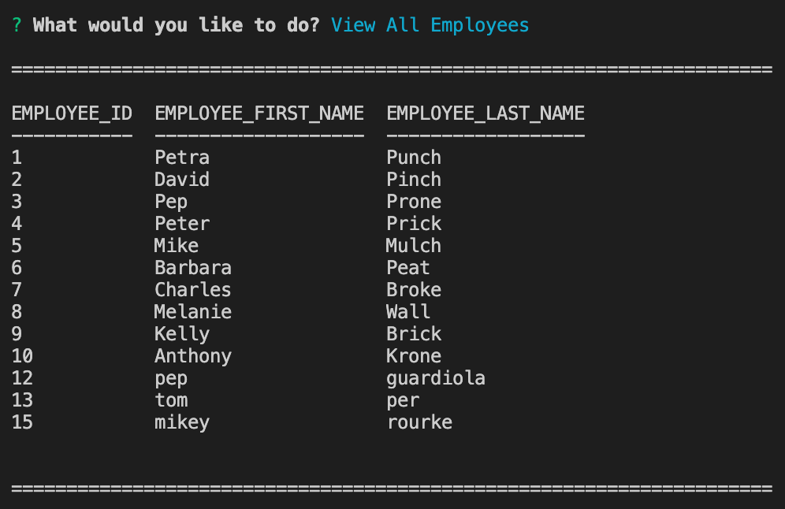
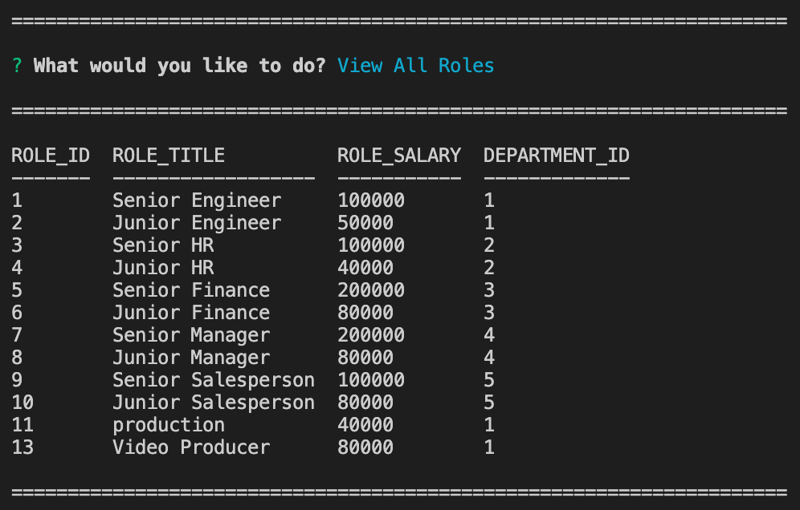
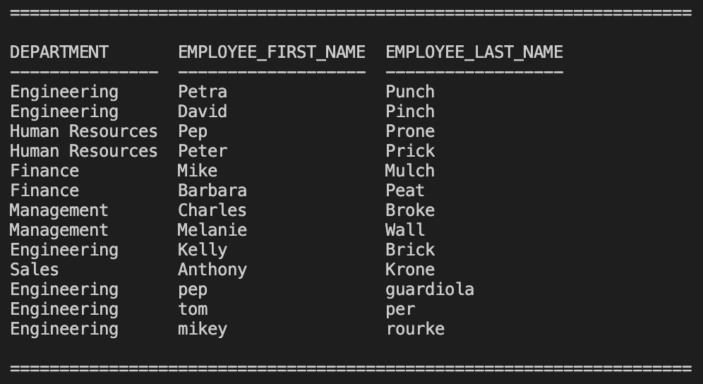
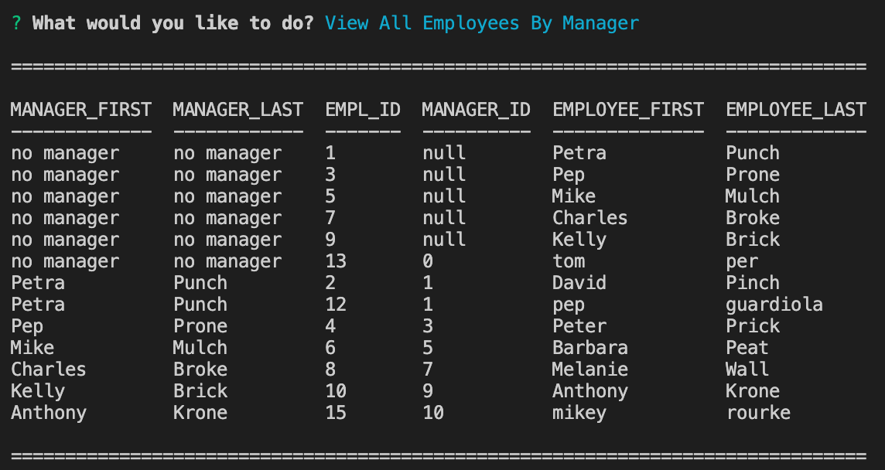
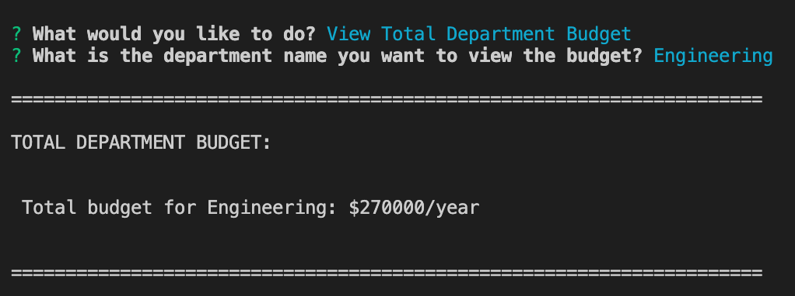

# Employee Tracker CMS

This application has an interface to make it easy for non-developers to view and interact with information stored in databases. The interface is what is known as [Content Management System](https://en.wikipedia.org/wiki/Content_management_system). 

The challenge for creating this application is to architect and build a solution to manage a company's employees using [Node](https://nodejs.org/en/), [Inquirer](https://www.npmjs.com/package/inquirer), and [MySQL](https://www.mysql.com/).

## Design

The database schema design contains 3 tables:
<div style="width:50%">


</div>

- - -

* **department**:

  * **id** - INT PRIMARY KEY
  * **name** - VARCHAR(30) to hold department name
- - -
* **role**:

  * **id** - INT PRIMARY KEY
  * **title** -  VARCHAR(30) to hold role title
  * **salary** -  DECIMAL to hold role salary
  * **department_id** -  INT to hold reference to department role belongs to

- - -

* **employee**:

  * **id** - INT PRIMARY KEY
  * **first_name** - VARCHAR(30) to hold employee first name
  * **last_name** - VARCHAR(30) to hold employee last name
  * **role_id** - INT to hold reference to role employee has
  * **manager_id** - INT to hold reference to another employee that manager of the current employee. This field may be null if the employee has no manager

- - -

## Features

This command-line application allows the user to:

  * add departments, roles, employees

  * view departments, roles, employees

  * update employee roles

  * update employee managers

  * view employees by manager

  * delete departments, roles, and employees

  * view the total utilized budget of a department -- ie the combined salaries of all employees in that department

## User Story

```
As a USER
I WANT to be able to view and manage the departments, roles, and employees in the company
SO I can organize and focus on the business
```

## Technologies

* The [MySQL](https://www.npmjs.com/package/mysql) NPM package is used to connect the MySQL database to Node and perform queries.

* The [InquirerJs](https://www.npmjs.com/package/inquirer/v/0.2.3) NPM package to interact with the user via the command-line.

* The [Console.table](https://www.npmjs.com/package/console.table) NPM package is used to print MySQL rows to the console. 

* The [Asciiart-logo](https://www.npmjs.com/package/asciiart-logo) NPM package is used to print the logo and the introduction message to the user.

* We used a separate file to contain the functions that perform specific SQL queries. A constructor function or a class is helpful for organization.

* Some queries to the database perform SQL JOINS to extract the desired data.

* We use the `seed.sql` file to pre-populate the database. This makes the development of individual features much easier.

## Application Example


## GitHub Repository URL

[Employee Tracker CMS](https://github.com/tomaspz/employee-tracker-cms)

## Screenshots

When application starts:
<div style="width:50%">



When viewing all employees:


When viewing all roles:


When viewing all departments:


When viewing all employees by department:


When viewing all employees by manager:


When viewing the total department budget:

</div>
